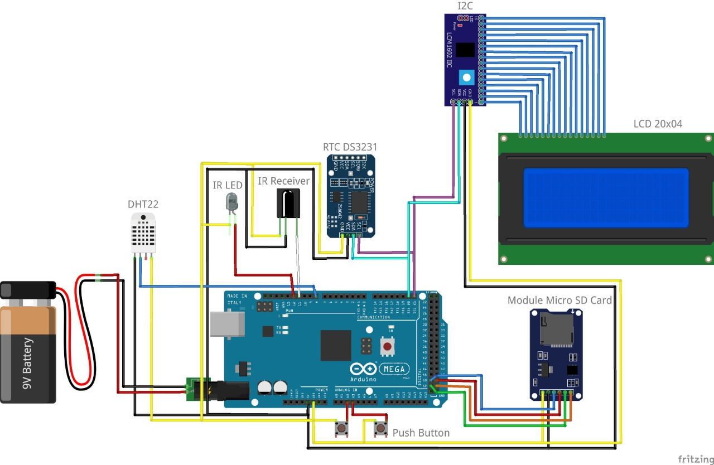
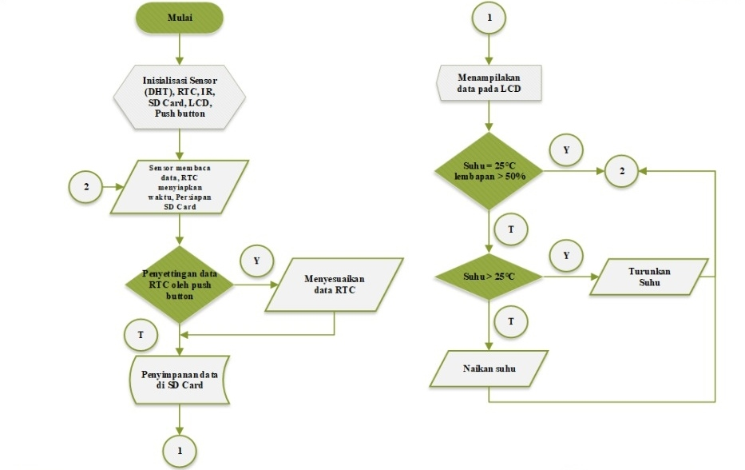

# ❄️ Smart IR Remote-Controlled Air Conditioner System with Temperature Automation

This Arduino-based project automates air conditioner (AC) control using infrared (IR) communication and environmental sensors. It reads real-time temperature and humidity data, logs environmental conditions to an SD card, and adjusts the AC temperature using **IR remote signals**. Additional tools are included to extract and test raw IR signals.

---

## 📁 Project Structure

```

.
├── hardware/
│   └── schematic.jpg                # Circuit diagram of the system
├── software/
│   ├── code.txt                     # Documentation or notes
│   ├── flowchart.jpg                # System workflow diagram
│   ├── getdata-remote.ino           # Capture raw IR signals from a remote (long IR support)
│   ├── main.ino                     # Main automation logic (sensor + LCD + IR control + SD logging)
│   ├── test-remote.ino              # Test script to resend a captured IR signal
│   └── library/                     # Required Arduino libraries (as ZIPs)
│       ├── Arduino-IRremote-master.zip
│       ├── button-master.zip
│       ├── DHT-sensor-library-master.zip
│       ├── LiquidCrystal_I2C-master.zip
│       └── RTClib-master.zip
├── LICENSE
└── README.md

```

---

## 🧠 Features

- 🌡️ Real-time **temperature and humidity monitoring** using DHT22  
- 📟 Display on a 20x4 **I2C LCD**  
- 📅 Accurate timestamping using **DS3231 RTC module**  
- 💽 **Data logging to SD card** (`logger.txt`) in CSV format  
- 🛰️ Control **AC temperature remotely** using **IR codes** (Panasonic format)  
- 🔘 Onboard buttons for **manual RTC setup**  
- 📡 Tools to **capture** and **test raw IR signals**

---

## 🔧 Required Hardware

- Arduino Mega 2560 (or compatible)  
- DHT22 temperature and humidity sensor  
- DS3231 RTC module  
- 20x4 LCD with I2C module  
- SD card module  
- IR transmitter (IR LED)  
- IR receiver (for capturing remote codes)  
- Two push buttons (for RTC setting)
- AC Remote (e.g., Panasonic) for IR signal learning  
- Optional: 10k pull-up resistors, breadboard, jumper wires

---

## 📥 Library Installation

Use the Arduino Library Manager or import from `software/library/` folder:
- [IRremote](https://github.com/z3t0/Arduino-IRremote)
- [DHT sensor library](https://github.com/adafruit/DHT-sensor-library)
- [LiquidCrystal_I2C](https://github.com/johnrickman/LiquidCrystal_I2C)
- [RTClib](https://github.com/adafruit/RTClib)
- [ezButton](https://github.com/ArduinoGetStarted/button)

---

## 🚀 How to Use

### 1. 📡 Capture AC Remote Signals (Optional)
Use `getdata-remote.ino` to record raw IR codes:
- Connect IR receiver to **pin 2**
- Open serial monitor at **115200 baud**
- Press the remote button
- Copy the `Raw:` array from Serial Monitor

### 2. 🧪 Test IR Signals (Optional)
Use `test-remote.ino` to test sending the raw signal with IR LED on **pin 3**.

### 3. 🎯 Run Main Program
Upload `main.ino`:
- LCD shows current date, time, humidity, and temperature
- Automatically turns **AC ON** and sets temperature based on DHT22 input:
  - `T > 25°C` → Turn ON AC with adjusted temperature
  - `T ≤ 20°C` → Turn OFF AC
- Data is logged to `logger.txt` on SD card every second
- RTC setup can be accessed using **buttons A2 & A3**

---

## 📝 Sample Logged Data

```

Date       ; Time     ; Humidity ; Temperature ; AC_Temp
06/05/2025 ; 12:00:01 ; 65       ; 30          ; 20
06/05/2025 ; 12:00:02 ; 64       ; 29          ; 21
06/05/2025 ; 12:00:03 ; 63       ; 22          ; AC OFF

```

---

## 📷 Hardware Design



---

## 🔄 Flowchart



---

## 💡 Applications

- Smart classroom or office AC control  
- Temperature-regulated greenhouses  
- IR learning remote systems  
- Arduino-based home automation projects

---

## 📜 License

This project is released under the [MIT License](LICENSE).  
Portions of `getdata-remote.ino` and `test-remote.ino` are credited to [AnalysIR](http://www.analysir.com) and [Ken Shirriff](http://arcfn.com)

---

## 👤 Author

Developed by [2black0](mailto:2black0@gmail.com)

---

> 🧊 Ready to make your air conditioner smart? Flash, point, and chill 😎